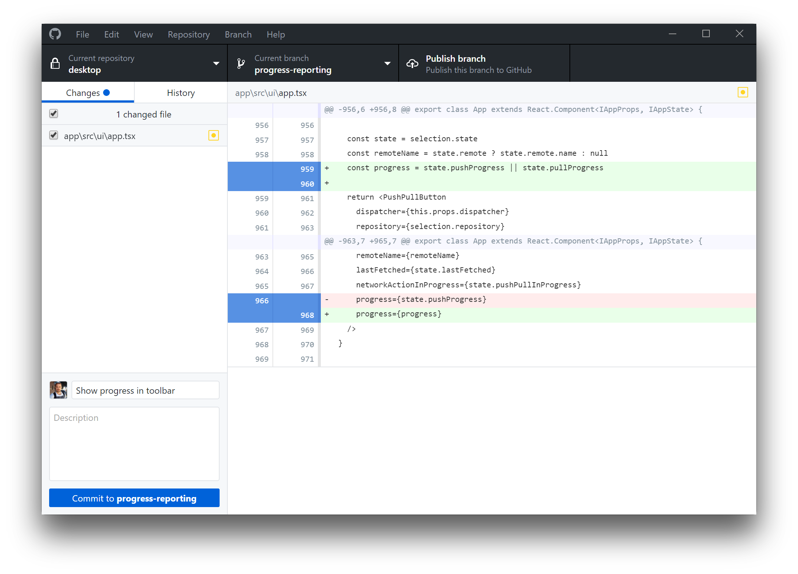

# Rationale #

This repo describes some steps and paths to execute [Github desktop app](https://desktop.github.com/) inside a proxy environment.

### What is this repository for? ###

* Quick summary
     * Github desktop application running under a proxy server
     

### How do I get set up? ###

* Summary of set up
     * Mostly of the steps were done on MacOSX El Capitan environment. 
     * Update: they were replicated on MacOSX Sierra with optimum result.
* Configuration
     * Check the [issues](https://bitbucket.org/imhicihu/setting-up-github-under-proxy/issues) 
* Dependencies
     * [Github desktop app](https://desktop.github.com/)
   	 * [Xcode comand line](https://developer.apple.com/download/more/)
	 * [GPG](https://www.gnupg.org/download/) (_optional_)
* How to run tests
     * Follow this [steps](/Github_desktop_app_installation.md)
* Deployment instructions
     * Check the [issues](https://bitbucket.org/imhicihu/setting-up-github-under-proxy/issues)

### Who do I talk to? ###

* Repo owner or admin
     - Contact `imhicihu` at `gmail` dot `com`
### Code of Conduct

* Please, check our [Code of Conduct](https://bitbucket.org/imhicihu/setting-up-github-under-proxy/src/master/code_of_conduct.md)
   
### Legal ###

* All trademarks are the property of their respective owners.

### Copyright ###

This work is licensed under a [Creative Commons Attribution-ShareAlike 2.0 Generic License](http://creativecommons.org/licenses/by-sa/2.0/).